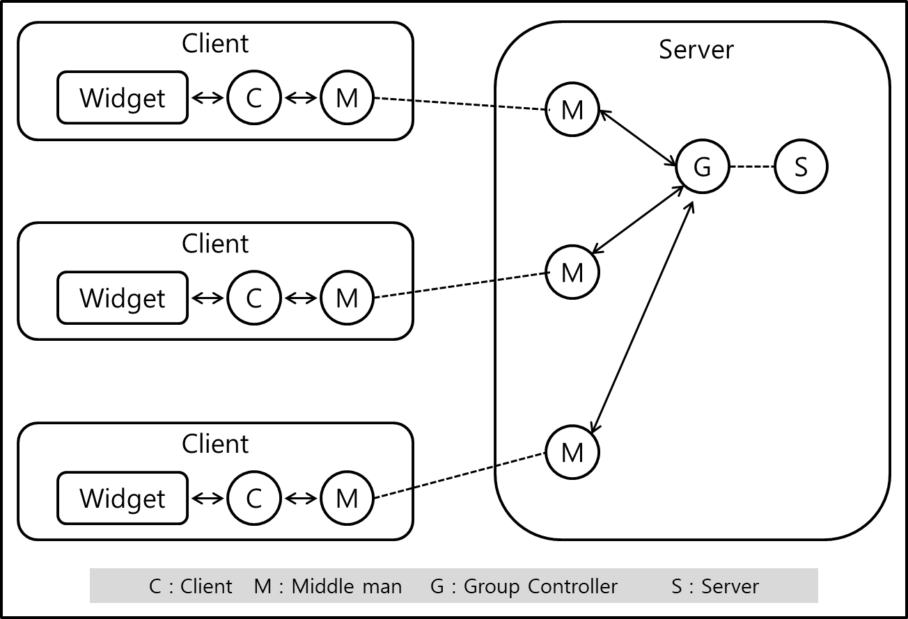

## Chapter 11. IRC Lite

### Intro

* IRC : Internet Relay Chat 
    * 1988년 핀란드의 Jarkko Oikarinen이 개발한 실시간 인터넷 채팅 프로토콜 
    * 소셜 네트워크의 시초 

* 자체적인 IRC 프로토콜을 만들어 본다. 호환성 없다. 
* 프로세스 구조는 다음과 같다.

    * Widget : GUI, 메시지를 보내거나 받은 메시지를 표시하는 데 사용

    * Client : Widget에서 온 메시지를 관리, 그 메시지를 현재 그룹의 그룹 컨트롤러로 보낸다. 또한, 그룹 컨트롤러에서 온 메시지를 받아 widget으로 전송하는 것도 담당.

    * Group Controller, broadCasting을 담당. 이 컨트롤러는 그룹에 신규로 참가한 멤버나 그룹에서 탈퇴한 멤버를 추적하며 그룹에 아무도  남지 않은 경우 죽는다!

    * Server : GC를 추적하는 것, 오직 새로운 멤버가 그룹에 참가하려 할 때만 필요하다? 채팅 서버는 단일 프로세스, GC는 활성 그룹마다(단톡방 하나하나 마다) 하나씩 있다.

    * Middle Man : 시스템으로 데이터를 전송하는 역할을 담당. 프로세스 M은 두 머신간 저수준 소켓 인터페이스를 숨긴다. 
        * 근본적으로 M은 머신 간의 물리적인 경계를 추상화시킨다. 