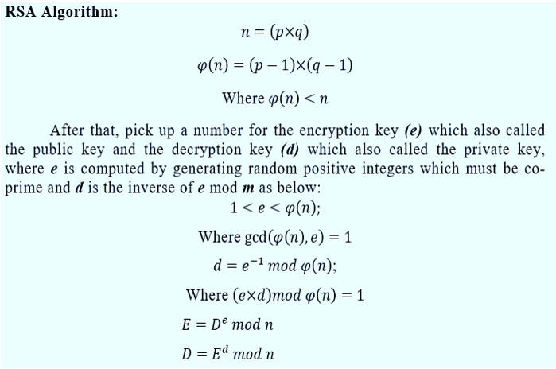

## Chapter 10. 보안

### 1. 보안의 기본

* 메신저 서비스의 구현 방법에 따라서 감청 가능 여부가 갈린다.

* 스노든, NSA, PRISM, Citizenfour

* 이 세상에 완벽한 보안은 없다. 

### 2. 클라이언트 보안

* 클라이언트, 특히 모바일 클라이언트는 프로그램 자체가 사용자에게 완벽하게 공개되어 있기 때문에 보안에 매우 취약, 리버스 엔지니어링으로 소스코드를 확인할 수 있고 수정할 수 있다.

* 어떤 조치를 취할 수 있는가? : code obfuscaton, 코드 난독화!

* 클라이언트에서 할 수 있는 최선의 보안 정책은 중요한 데이터의 계산과 저장을 클라이언트에서 하지 않고 서버에 맡기는 것이다.

### 3. 서버 보안

* 서버가 설치된 시스템, 즉 OS 자체의 보안도 중요하다. 그 다음은 서버에서 동작하는 우리의 서비스 프로그램의 보안을 생각해야 한다.

* 서버 프로그램에 접근하는 주체는 클라이언트

* 리눅스 : traceroute, 윈도우 : tracert 명령어를 실행 -> 목적지와 나 사이에 존재하는 라우터들의 존재를 알 수 있다.

    * 라우터들 중 아무곳에서나 지나가는 패킷을 전부 감시하고 있다면 나의 패킷도 볼 수 있을 것이다. 

    ```
        window
        >> tracert -4 8.8.8.8
        >> 
            최대 30홉 이상의
            dns.google [8.8.8.8](으)로 가는 경로 추적:

            1     4 ms     1 ms     2 ms  172.30.1.254
            2     *        *        *     요청 시간이 만료되었습니다.
            3     3 ms     2 ms     3 ms  125.141.249.145
            4     *        *        *     요청 시간이 만료되었습니다.
            5     *        *        *     요청 시간이 만료되었습니다.
            6     5 ms     5 ms     7 ms  112.174.42.242
            7    35 ms    32 ms    34 ms  72.14.209.154
            8     *        *        *     요청 시간이 만료되었습니다.
            9    32 ms    32 ms    33 ms  dns.google [8.8.8.8]

            추적을 완료했습니다.
        ```
    
        * 신기허네

        * 패킷 암호화를 적용하려면 HTTP 대신에 HTTPS를 사용하면 된다. 이는 얼랭 코드 한 줄이면 된다. 

        * 프로그래머로서 HTTPS를 사용한다는 것의 의미를 알아야 한다. 

### 4. 암호화

* Encryption 
* 메시지 변환 규칙 and 키 -> Decryption

* 카이사르 암호에서의 키는 3
* 제2차 세계대전, 독일, 에니그마, 아르투스 슈르비우스, 발명은 1차 세계대전 말미
* 1해 1589경에 해당하는 경우의 수, 루빅스큐브333은 4325경
* 앨런 튜링은 에니그마 암호화 자체의 오류를 이용, 20분 만에 암호를 해독할 수 있는 기계, Bombe를 발명!! respect

* 현대 컴퓨터의 암호화 분야에서는 Key를 누구에게나 공개하였음에도 불구하고 보안상 안전한 암호화 알고리지즘도 존재한다. 공개키 방식

* 대칭키 : 비대칭키(공개키)

* 대칭키 
    * 하나의 키로 좌물쇠를 열고 닫는 느낌
    * 내가 잠근 자물쇠를 다른 사람이 풀기 위해서는 내가 사용한 키를 전달해줘야 한다.    
    * 키가 네트워크를 통해서 패킷으로 전달될 경우 유출될 위험이 매우 크다!

* 공개키 
    * 두 개의 키를 사용
    * 하나는 암호화, 다른 하나는 복호화
    * 어떤 키를 공개하느냐에 따라서 원하는 대로 사용할 수 있다. 
    * RSA는 주로 복화화 키를 공개하는 방식, 디지털ㄹ 서명 부분에 쓰인다. 

### 5. Base64

* 바이너리 데이터를 -> 화면에 표시할 수 있는 문자열 데이터로 변환할 때 사용하는 방법
* Base64가 암호화 알고리즘은 아니다. MIME, HTTP, OpenPGP 등 다양한 프로토콜에서 변형하여 사용하고 있기 때문에 숙지하고 있을 필요

```erlang
1> base64:encode(<<1,2,3>>).
>> <<"AQID">>
2> base64:decode(<<"AQID">>).
>> <<1,2,3>>
```

* Base64는 8bit가 6bit단위로 바뀌는 것 : 8to6을 적용하면 원래에 비해서 전체적으로 30% 정도 데이터의 길이가 증가한다. 
    * 이해하지 못했다, 어떤 방식으로 이해해야 하는 것이지? 
    * 8/6*Prev = (1+0.33333)*Prev = Next. Prev에 대응 되는 것은 ?  
    * 아하 이해했다.
    * 일단 기본적으로 8bit를 1Byte라고 부르고 6bit를 1Syte라고 부르자. 그리고 Byte, Syte를 각각 독립전인 기저 단위라고 생각하자.
    * 3Byte 데이터는 4Syte 데이터라고 할 수 있다. 
    * 즉, 3개(Byte)가 4개(Syte)가 된 것이지


### 6. MD5, SHA-1

* MD5 : message-digest algorithm : 암호화 해시 함수 중 하나로 RFC-1321에 정의되어 있다.  주어진 메시지를 특정한 숫자값으로 변환시키는 함수

    * 2^128 개를 구분할 수 있지만, 전세계 데이터의 개수보다는 작다는 것, 언젠가는 겹치는 해시값이 존재할 것이라는 것 


* 확률론에서 말하는 [Birthday Paradox](https://en.wikipedia.org/wiki/Birthday_problem) 문제 : n명이 모였을 때 그 중 생일이 같은 사람이 존재할 확률을 구하는 문제 
    * 23명만 모여도 생일이 같은 사람이 존재할 확률은 50.7%

* MD5는 이미 밝혀진 결함이 존재하여 의도적으로 동일한 해시값을 생성할 수 있으므로 사용하지 않는 것이 좋다!!

* MD5의 대안 : SHA-1, secure hash algorithm은 160bit를 사용한다. SHA-256, 384, 512 ok

* 얼랭에서 crypto라는 모듈을 사용한다! 

    * crpyto:hash(Type, Data) -> Digest
    * Type 부분에 md5, ripemd150, sha, sha224, sha256, sha384, sha512
    * Data 부분에는 list나 binary 형식


### 7. DES, AES 

* DES : Data Encrption Standard는 대칭키 알고리즘을 사용해 데이터를 암호화하는 오래된 알고리즘,key의 크기가 56bits밖에 안 된다는 점 : 현대 병렬 컴퓨터를 이용하면 무차별 대입 공격에 취약하다

* AES : Advanced Encrpyion Standard, Rijndael Algorithm 

    * 128,192,256 bits의 Key를 사용할 수 있다. 
    * Block size는 128 bits로 고정된다.

    * block_encrypt(Type, Key, IVec, PlainText) -> CiperText
    * block_decrypt(Type, Key, IVec, PlaCiperTextinText) -> PlainText

### 8. RSA

* 1977, Ron Rivest, Adi Shamir, Leonard Adleman
* 공개키는 누구에게나 공유, 비밀키는 절대 공유x
* 그런데 비밀키가 털리면 끝

 


### 9. Diffie-Hellman-Merkle key exchange

### 10. SSL/TLS

### 11. bcrypt

### 12. 모바일 결제 검증

* 모바일 결제는 정말 중요한 부분

* 최근, 1월 1일, [이곳](https://polyphiatabs.com/products/tim-henson-jdbsc)에서 타브 악보를 구매하기 위해 G-Pay를 사용하였는데, 결제 완료 버튼을 여러 번 눌러도 Final 결제 완료 페이지가 안 떴는데, 4번의 중복 결제(삼성카드 앱 내역을 보니 정상 결제가 이뤄진 것으로 처리가 됨)가 일어났을뿐만 아니라, 아예 그 상품(악보)를 볼 수 있는 URL조차 받지 못했다. 이건 어디서 잘못된 것일까? 


---

* 보안 분야도 정말 흥미롭다. 왠지 정수론을 직접적으로 이용하는 영역 같기도하고, 흠 이런 건 이미 연구소급에서 발견, 개발, 검증된 것, 그래서 어떤 상위 단체에 의해 인증받은 것들을 사용하는 것으로 끝나는 것인가, 아니면 개인적으로 최적화? 같은 것을 해서 성능향상을 도모할 껀덕지가 남아 있는 영역인 것인가